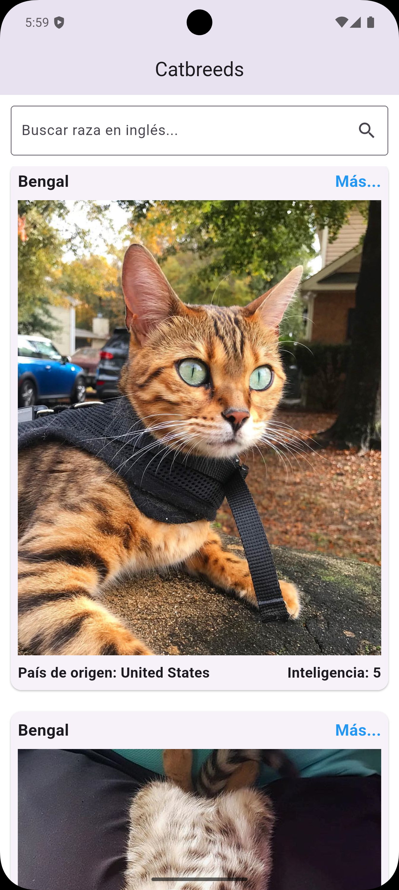
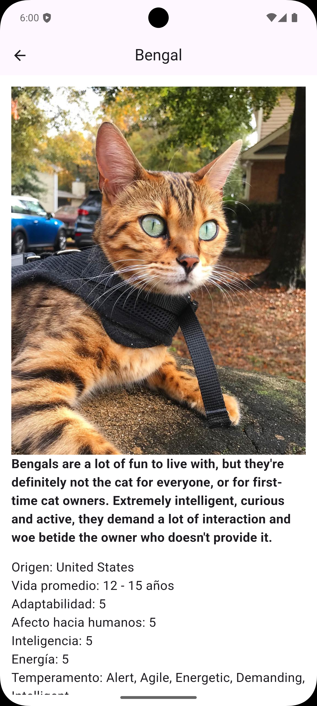

# Catbreeds App 🐾

¡Descubre el fascinante mundo de las razas de gatos con la aplicación Catbreeds! Explora una amplia variedad de razas felinas, aprende sobre sus orígenes, niveles de inteligencia y otras características interesantes, todo en una interfaz hermosa y fácil de usar.

## 🌟 Características Destacadas

* **Exploración de Razas:** Navega por una lista completa de razas de gatos.
* **Búsqueda Rápida:** Encuentra razas específicas usando la barra de búsqueda (por nombre en inglés).
* **Detalles Completos:** Accede a información detallada de cada raza, incluyendo origen, inteligencia, adaptabilidad y esperanza de vida.

## 📱 Capturas de Pantalla


_Pantalla de inicio con la lista de razas._


_Pantalla de detalles de una raza._

## 🚀 Instalación

Sigue estos pasos para poner en marcha el proyecto en tu máquina local.

### Prerrequisitos

Asegúrate de tener instalado Flutter en tu sistema. Si no es así, puedes seguir la guía de instalación oficial: [Instalar Flutter](https://flutter.dev/docs/get-started/install)

### Pasos

1.  **Clona el repositorio:**
    ```bash
    git clone [https://github.com/tu-usuario/catbreeds_app.git](https://github.com/tu-usuario/catbreeds_app.git)
    cd catbreeds_app
    ```
    *(Asegúrate de cambiar `https://github.com/tu-usuario/catbreeds_app.git` por la URL real de tu repositorio de GitHub o donde esté alojado tu código.)*

2.  **Obtén las dependencias:**
    ```bash
    flutter pub get
    ```

3.  **Ejecuta la aplicación:**
    ```bash
    flutter run
    ```
    Esto lanzará la aplicación en el emulador o dispositivo conectado que tengas configurado.

## 💡 Uso

Una vez que la aplicación esté instalada y en ejecución:

1.  **Explora las razas:** Desplázate por la lista de razas en la pantalla principal.
2.  **Busca una raza:** Utiliza la barra de búsqueda en la parte superior para filtrar las razas por su nombre en inglés.
3.  **Ver detalles:** Toca Mas.. en cualquier tarjeta de raza para ver información más completa, incluyendo su descripción, origen, inteligencia, adaptabilidad y esperanza de vida.

## 🛠️ Tecnologías Utilizadas

* **Flutter:** Framework para el desarrollo de la interfaz de usuario.
* **Dart:** Lenguaje de programación.
* **flutter_native_splash:** Para configurar la pantalla de inicio nativa.
* *(Aquí puedes añadir cualquier otra dependencia o API externa que uses, por ejemplo, si obtienes los datos de una API de razas de gatos como TheCatAPI)*
    * `http` (para peticiones HTTP)

## 📄 Licencia

Este proyecto está bajo la Licencia MIT. Consulta el archivo [LICENSE](LICENSE) para más detalles.
*(Si aún no tienes un archivo `LICENSE`, crea uno. La Licencia MIT es una buena opción para proyectos de código abierto.)*

## 📞 Contacto

Tu Nombre - [tu.email@example.com](mailto:tu.email@example.com)
Tu Perfil de GitHub - [https://github.com/tu-usuario](https://github.com/tu-usuario)

Link del Proyecto: [https://github.com/tu-usuario/catbreeds_app](https://github.com/tu-usuario/catbreeds_app)
*(Reemplaza `tu-usuario` y `catbreeds_app` con los detalles correctos de tu repositorio.)*

---
